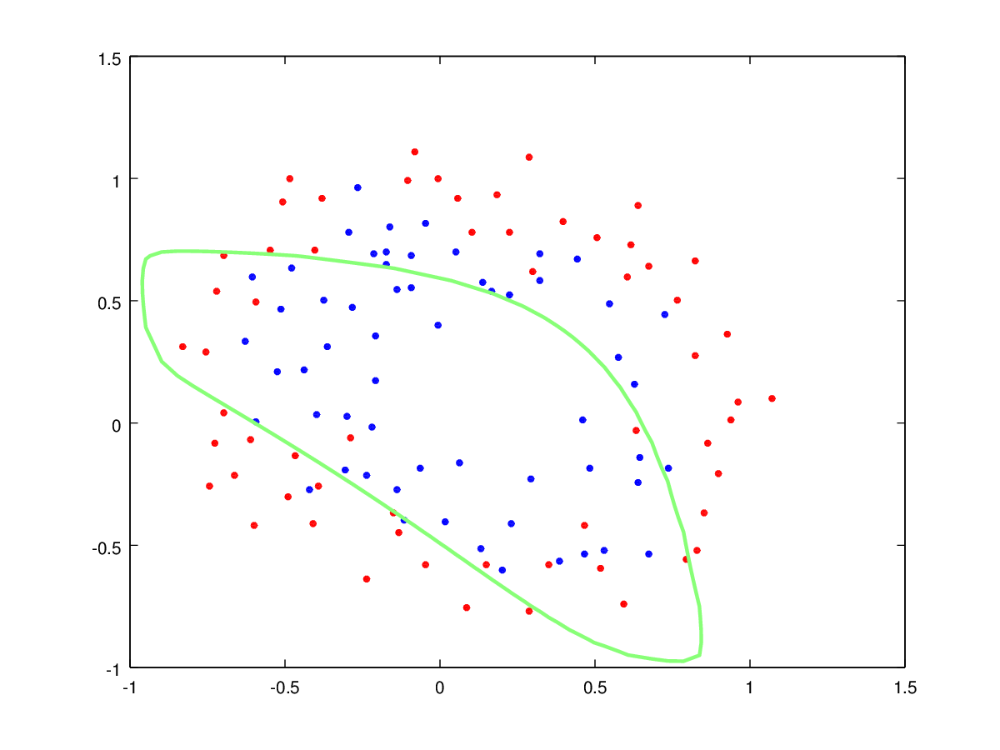
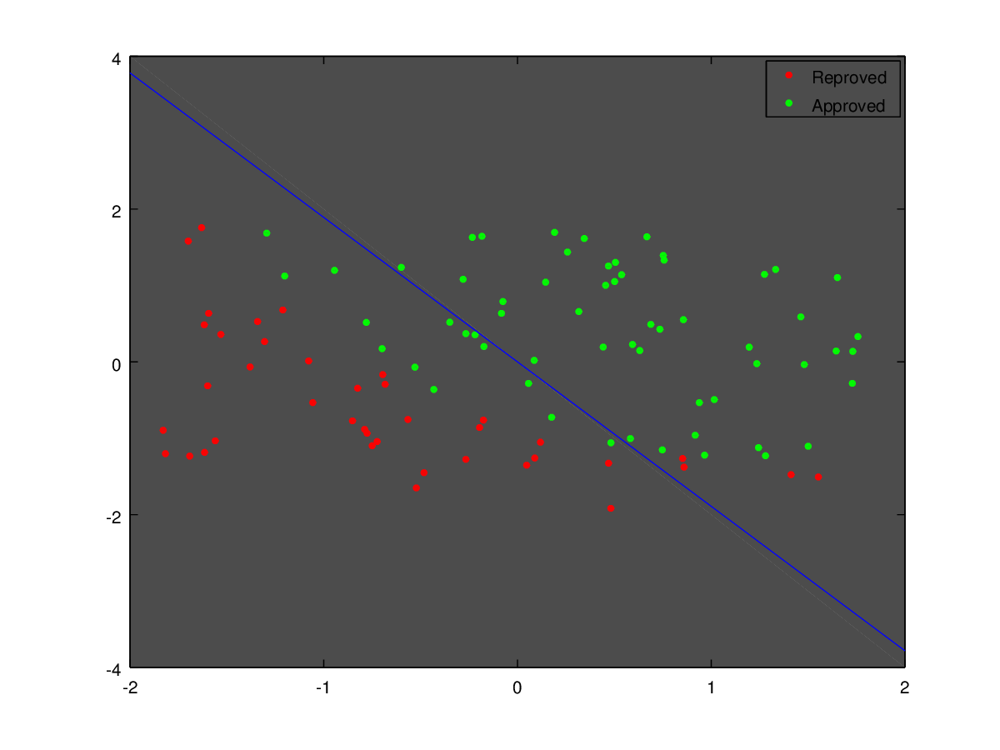

# :robot: "Machine Learning" and "Automated Learning" Summer Classes (2016)

> :warning: This repo was ported from Bitbucket!

|
:---:|:---:

## :book: Description
Computer Science Bachelor's degree assignments [January ~ May 2016].

## :mortar_board: Classes
 - Machine Learning
 - Automated Learning

## :computer: Technology
 - Octave
 - Implementations and solutions from scratch
 - No usage of Machine Learning APIs (e.g.: Tensorflow)
 - Handling matrix operations directly

## :scroll: Contents
 - Linear regression
 - Logistic regression
 - Regularization
 - Perceptron
 - Multilayer Perceptron (MLP)
 - Neural Networks
 - Cluster analysis
 - K-means

## :unlock: Problems solved
 - Boston Housing
 - Flower classification
 - Pima-indians diabetes
 - Breast cancer
 - Iris dataset clustering
